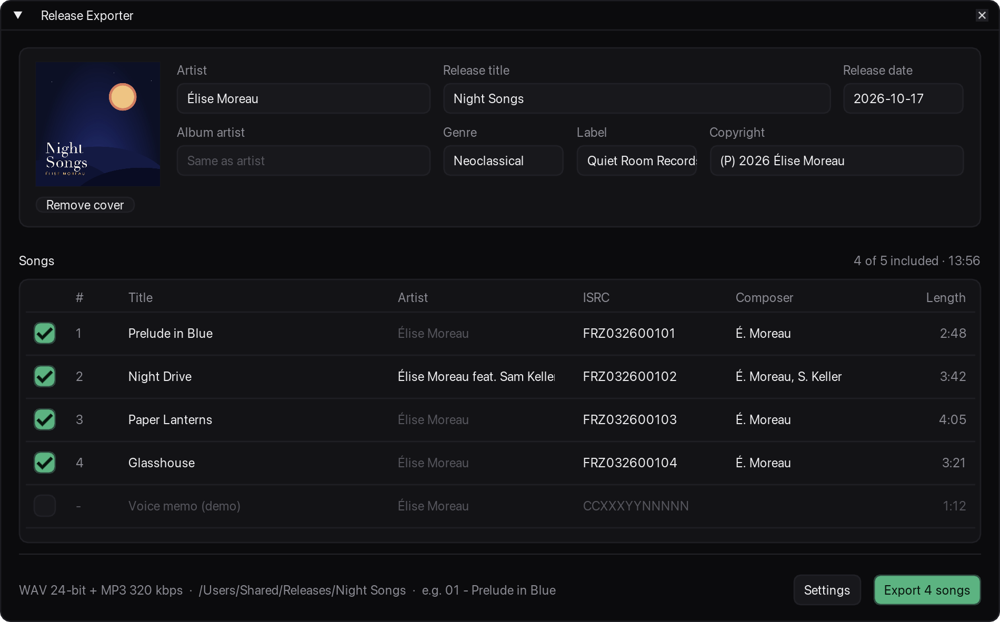
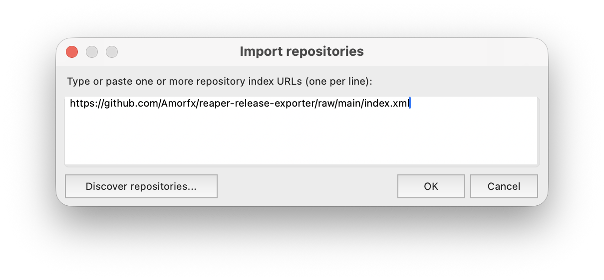
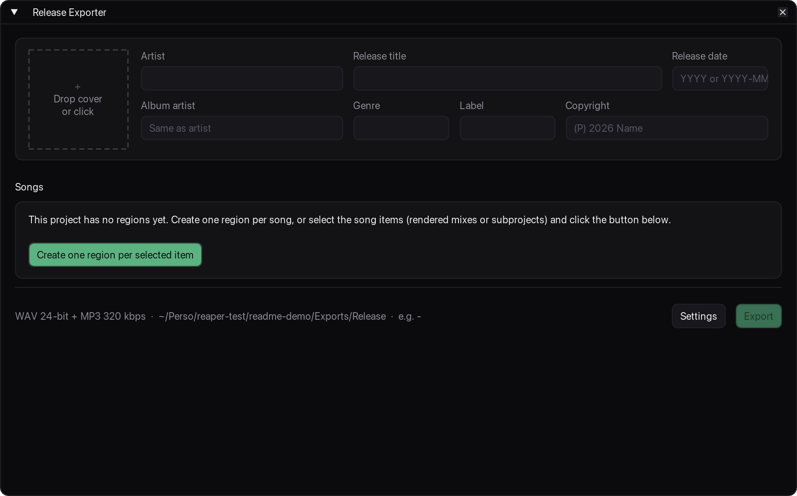
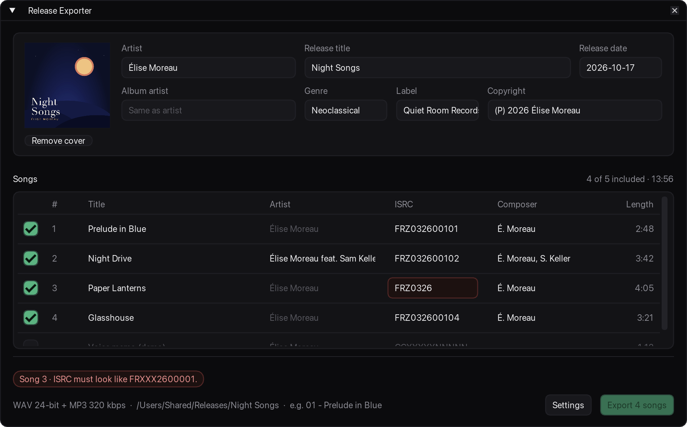
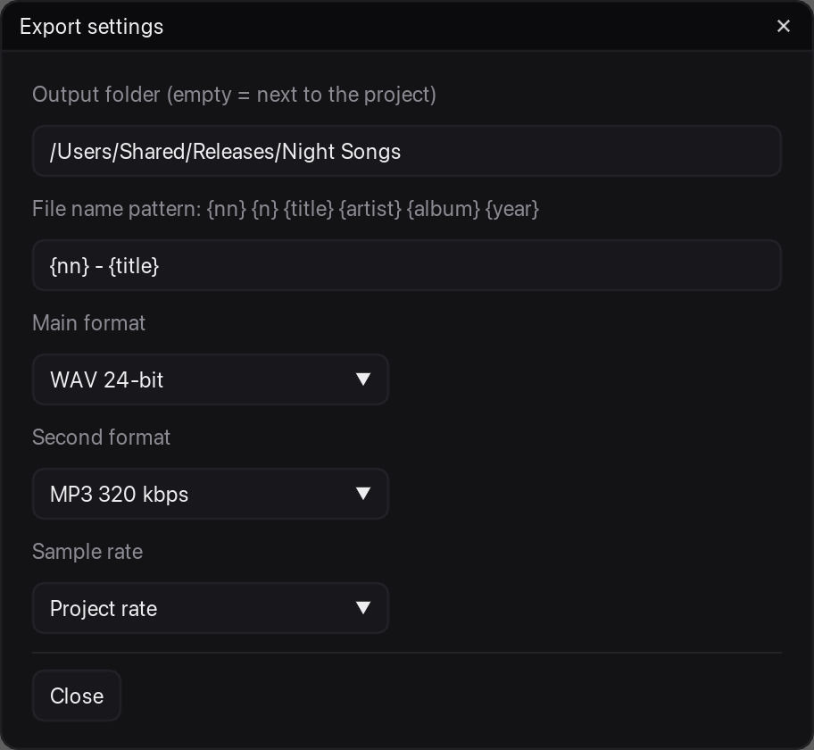
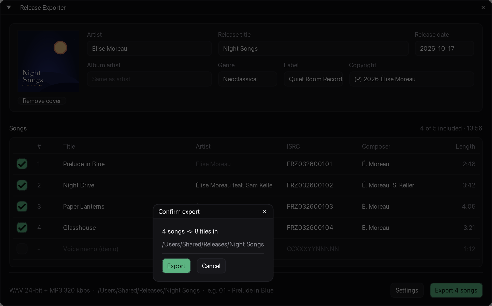
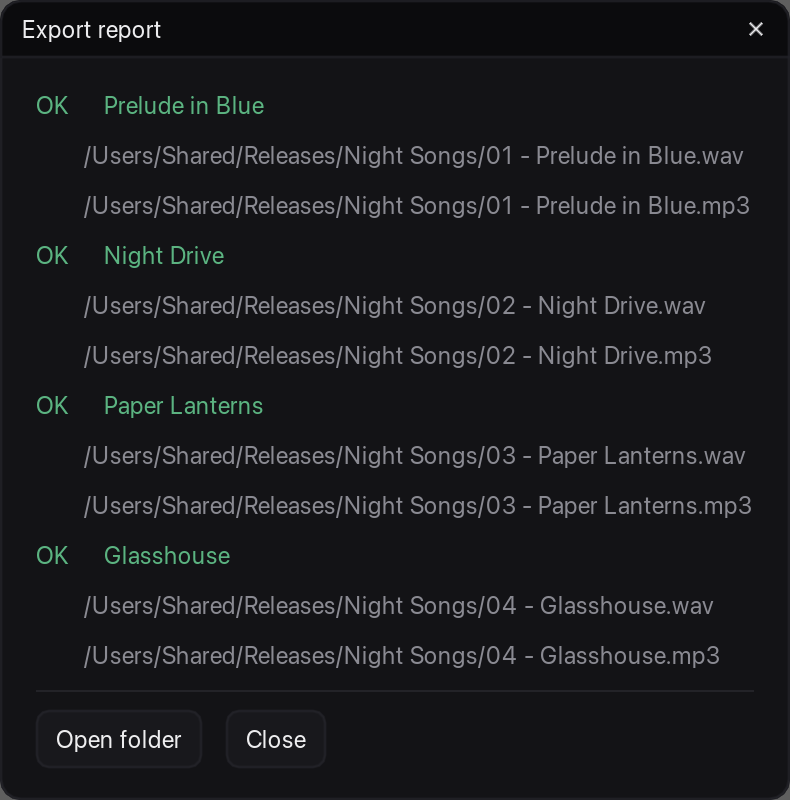

# Release Exporter for REAPER

**Tag a single, EP or album in one window and export every song as WAV + MP3/FLAC in one click.**

[](https://github.com/Amorfx/reaper-release-exporter/actions/workflows/ci.yml)


[](LICENSE)



Mastering your release in REAPER is the fun part. Typing the same artist, album, year and cover into every
render, then checking the files one by one, is not. Release Exporter keeps all of that in one place, inside your
project, and renders every song with complete, consistent tags.

## Features

- **One region = one song.** Your regions become the tracklist. No regions yet? One click creates them from the
  selected items.
- **Release-level fields filled once**: artist, album artist, title, release date, genre, label, copyright and
  cover art. Songs inherit them, and you only fill what differs per song (artist, ISRC, composer).
- **Complete tags in every format**: ID3v2.4 for MP3, RIFF INFO + ID3 for WAV, Vorbis comments for FLAC, with
  track numbers (`2/5`) and the embedded front cover.
- **Two formats per song in a single render**: WAV 24/16-bit, plus MP3 320 kbps CBR or FLAC 24-bit.
- **Safe**: problems are shown before you export, existing files are never overwritten without asking, and your
  own render settings are restored afterwards.
- **Saved with the project**: every field is stored inside the `.rpp`. Renaming a song renames its region, and
  Ctrl+Z works as you would expect.

## Requirements

| | |
|---|---|
| **REAPER** | 7.80 or newer. Only REAPER 7.80 (macOS) is tested; older 7.x releases may work but are not supported. |
| **[ReaImGui](https://forum.cockos.com/showthread.php?t=250419)** | Required (0.9 or newer). Draws the window. |
| **[js_ReaScriptAPI](https://forum.cockos.com/showthread.php?t=212174)** | Optional. Adds a JPEG/PNG filter to the cover picker and a *Browse…* button for the output folder. |
| **[SWS](https://www.sws-extension.org)** | Optional. Used by *Open folder* in the export report when available. |

ReaImGui and js_ReaScriptAPI both come from the **ReaTeam Extensions** repository, which ReaPack includes by
default.

## Installation

Release Exporter is installed with [ReaPack](https://reapack.com), REAPER's package manager.

1. **Install ReaPack** if you don't have it yet: follow the instructions on [reapack.com](https://reapack.com),
   then restart REAPER.
2. **Install ReaImGui**: *Extensions > ReaPack > Browse packages*, search for `ReaImGui`, right-click it >
   *Install*, then *Apply*. Restart REAPER when asked.
3. **Add this repository**: *Extensions > ReaPack > Import repositories…*, paste the URL below and click *OK*.

   ```
   https://github.com/Amorfx/reaper-release-exporter/raw/main/index.xml
   ```

   

4. **Install Release Exporter**: *Extensions > ReaPack > Browse packages*, search for `Release Exporter`,
   right-click it > *Install*, then *Apply*.
5. **Run it**: open the *Actions* list (`?`), search for `Release Exporter` and run
   **Script: Release Exporter.lua**. Tip: add it to a toolbar or give it a shortcut from the same list.

ReaPack keeps the script up to date: *Extensions > ReaPack > Synchronize packages*.

**Without ReaPack**: download `release-exporter-<version>.zip` from the
[latest release](https://github.com/Amorfx/reaper-release-exporter/releases/latest), unzip it into REAPER's `Scripts`
folder (*Options > Show REAPER resource path*) and load `release-exporter/Release Exporter.lua` from the *Actions* list
(*New action > Load ReaScript…*). You will have to update it by hand.

## Quick start

### 1. One region per song

Put all the songs of your release in one project, in order: rendered mixes, stems or subprojects all work. Each
song needs a region that covers it exactly.

Already have regions? Skip to step 2. Otherwise, select the song items and click **Create one region per
selected item**: each region is named after its item. One Ctrl+Z removes them all. Until the project has songs,
the window only shows this step and flags nothing else.



### 2. Fill the release card

At the top, fill the fields shared by every song: **Artist**, **Release title** and **Release date** are
required, the rest is optional. Drop a JPEG or PNG onto the cover square, or click it to pick a file.

Greyed-out text in a field is a placeholder, not a value: *Album artist* falls back to the artist when left empty.

### 3. Check the songs

Each row is a region, in timeline order.

- **Title** is the region name: editing it renames the region, and renaming the region updates the table.
- **Artist** falls back to the release artist; fill it only for a featuring or a split release.
- **ISRC** is optional. Distributors often assign ISRCs after the export; if you fill it, it must be valid
  (12 characters such as `FRXXX2600001`, dashes allowed).
- **Untick** a song to leave it out: it is dimmed and the numbering skips it.

Problems appear as chips at the bottom, prefixed with the song they concern (`Song 3 · …`). Red ones block the
export, amber ones are only warnings; the faulty cell turns red and shows the reason on hover.



### 4. Check the export settings

The line above the buttons sums up the formats, the output folder and an example file name. Click **Settings** to
change them:



| Setting | Default | Options |
|---|---|---|
| Output folder | `<project folder>/Exports/<Release title>` | A full path; `~/…` stands for your home folder |
| File name pattern | `{nn} - {title}` | See [File names](#file-names) |
| Main format | WAV 24-bit | WAV 24-bit, WAV 16-bit |
| Second format | MP3 320 kbps | MP3 320 kbps (CBR), FLAC (24-bit), None |
| Sample rate | Project rate | Project rate, 44.1 kHz, 48 kHz |

Settings are saved with the project.

### 5. Export

Click **Export N songs**. A summary shows what will be written and warns when files already exist:



REAPER then renders the songs one after the other. The report lists every file, and *Open folder* takes you
there:



## Reference

### Tags written

| Field | MP3 (ID3v2.4) | WAV (RIFF INFO, + ID3 chunk) | FLAC (Vorbis comments) |
|---|---|---|---|
| Title | `TIT2` | `INAM` | `TITLE` |
| Artist | `TPE1` | `IART` | `ARTIST` |
| Album artist | `TPE2` | ID3 only | `ALBUMARTIST` |
| Release title | `TALB` | `IPRD` | `ALBUM` |
| Release date | `TDRC` | `ICRD` | `DATE` |
| Track number | `TRCK` (`2/5`) | `ITRK` | `TRACKNUMBER`, `TRACKTOTAL` |
| Genre | `TCON` | `IGNR` | `GENRE` |
| Label | `TPUB` | ID3 only | `ORGANIZATION`, `LABEL` |
| Copyright | `TCOP` | `ICOP` | `COPYRIGHT` |
| ISRC | `TSRC` | ID3 only | `ISRC` |
| Composer | `TCOM` | ID3 only | `COMPOSER` |
| Cover | `APIC` (front cover) | `APIC` in the ID3 chunk | `PICTURE` block (front cover) |

WAV files carry both a RIFF INFO chunk and the same ID3 chunk as the MP3, so every field is readable. Empty
fields are not written.

### File names

The pattern is applied to each song, then the extension is added.

| Token | Value | Example |
|---|---|---|
| `{nn}` | Track number, two digits | `02` |
| `{n}` | Track number | `2` |
| `{title}` | Song title | `Night Drive` |
| `{artist}` | Song artist | `Élise Moreau` |
| `{album}` | Release title | `Night Songs` |
| `{year}` | Release date as typed | `2026` |

`{nn} - {artist} - {title}` gives `02 - Élise Moreau - Night Drive.wav`. The characters `/ \ : * ? " < > | $ ;`
are replaced by `-`, so `AC/DC: Live?` becomes `AC-DC- Live-`. Names stay valid on Windows too: leading dots
are removed, names that Windows reserves (`CON`, `NUL`, `COM1`…) get a trailing `-`, and very long titles are
shortened.

### What blocks the export

| Blocks the export | Warning only |
|---|---|
| Missing artist or release title | No cover image |
| Release date that is not `YYYY` or `YYYY-MM-DD` | Cover file not found (it is skipped) |
| Cover that is not a JPEG or PNG | |
| Invalid ISRC | |
| Song without a title | |
| No song included | |
| Two songs producing the same file name | |
| Unsaved project and no output folder | |
| Output folder that is not a full path, or that cannot be created | |

## Good to know

- **Each song is rendered exactly from its region's start to its end.** To keep a reverb tail or a fade-out,
  extend the region.
- **Songs are rendered from the master mix.** For its own renders the script sets the source, bounds, file
  names, formats, sample rate and tags, then restores your render settings. Channels, normalization and dither
  still come from your project's render settings.
- **Everything is saved in the `.rpp`**, so save the project to keep your metadata. Only the title rename is part
  of REAPER's undo history; the other fields are not.
- **Existing files are only replaced after you confirm.** If a file is open in another app and cannot be
  replaced, that song is reported as failed and the others still render.
- **Cancelling a render** in REAPER's render window asks whether to continue with the remaining songs.
- **Several projects**: the window follows the active project tab.

## Troubleshooting

**"Release Exporter needs ReaImGui 0.9 or newer."** Install ReaImGui (see [Installation](#installation), step 2)
and restart REAPER.

**The Export button is greyed out.** Look at the red chips at the bottom: each one names what to fix, and the
faulty cell is red.

**"Save the project or choose an output folder."** The default output folder is next to the project file, so a
new project needs to be saved first, or you can pick a folder in *Settings*.

**"Output folder must be a full path…"** The folder in *Settings* is relative (`Exports`, `../Mix`): type the whole
path, such as `/Users/you/Music/Releases`, or start it with `~/` for your home folder.

**"Output folder cannot be created…"** Neither the folder nor any of its parents can be written to: a disconnected
drive, a typo in `/Volumes/…`, or a folder you don't have write access to.

**A song reports "Cannot overwrite …".** The file is open in another application (a player, a DAW). Close it and
export again.

Found a bug or have an idea? [Open an issue](https://github.com/Amorfx/reaper-release-exporter/issues).

## Development

The script is plain Lua 5.4 on top of the REAPER and ReaImGui APIs. Everything that doesn't draw is tested
against a fake REAPER API.

```sh
luarocks install busted && luarocks install luacheck
busted          # unit tests
luacheck .      # lint
```

| Path | Content |
|---|---|
| `Rendering/Release Exporter.lua` | Entry point (the ReaPack package) |
| `Rendering/release_exporter/` | Model, REAPER adapters, renderer, metadata mapping |
| `Rendering/release_exporter/ui/` | ReaImGui views and theme |
| `tests/` | busted specs and the fake REAPER API |
| `tools/` | Probes used to check REAPER's behaviour (not shipped) |
| `docs/` | REAPER API notes, the manual test checklist and the README screenshots |

To try your changes in REAPER, link the repository into REAPER's `Scripts` folder
(*Options > Show REAPER resource path*) and load `Rendering/Release Exporter.lua` from the *Actions* list:

```sh
ln -s "$PWD" "<resource path>/Scripts/reaper-release-exporter"
```

## License

[MIT](LICENSE) © Clément Décou
